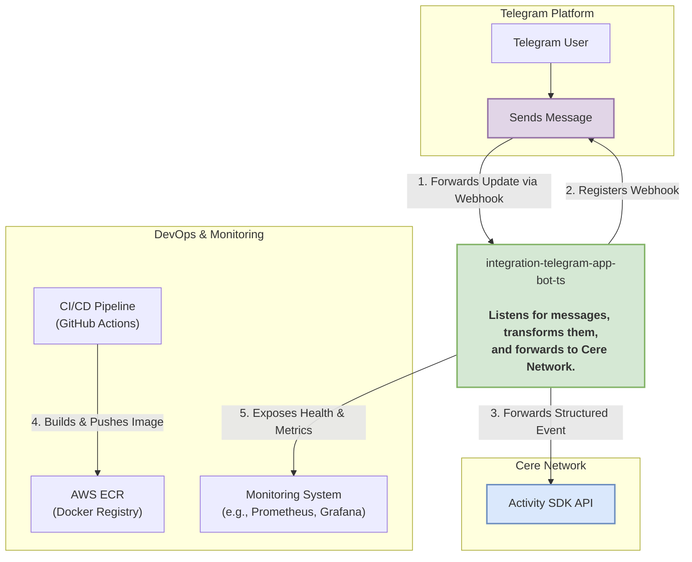

# High-Level System Overview

This document provides a high-level, C4-style context diagram that illustrates the position of the **Integration Telegram App Bot** within its operational ecosystem. It shows the key external systems it interacts with and the primary data flows between them.

## Context Diagram

## Explanation of Interactions

1.  **Telegram Webhook (Incoming)**: The primary input to the system. The Telegram API sends a POST request (a webhook) to the bot's `/telegram/webhook` endpoint every time a relevant event (like a new message) occurs in a configured group. This is an asynchronous, push-based interaction.

2.  **Webhook Registration (Outgoing)**: On startup, the bot makes a single API call to the Telegram API (`/setWebhook`) to register its public URL. This tells Telegram where to send future updates. This ensures the connection is always active and correctly configured after any deployment.

3.  **Event Forwarding (Outgoing)**: This is the bot's main output. After receiving and processing a Telegram message, the bot constructs a standardized event payload and sends it to the Cere Activity SDK's API endpoint. This is a critical integration that bridges the two systems.

4.  **CI/CD Pipeline (Deployment)**: The GitHub Actions workflow automatically builds a new Docker image from the `Dockerfile` on every push to the main branches. This image is then pushed to the Amazon ECR (Elastic Container Registry), making it available for deployment.

5.  **Monitoring & Health Checks (Incoming)**: The bot exposes several endpoints (e.g., `/health`, `/health/ready`, `/health/live`). External monitoring systems periodically call these endpoints to ensure the bot is running correctly and is ready to receive traffic. This is essential for maintaining service reliability in a production environment.
