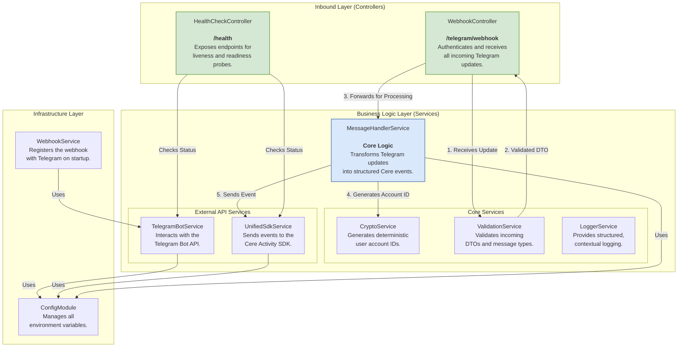

# Component Diagram

This document provides a C4-style component diagram that details the internal building blocks of the **Integration Telegram App Bot**. It illustrates how the different services, controllers, and modules within the NestJS application interact to fulfill the bot's purpose.

## Component Diagram

## Component Responsibilities

### Controllers (Inbound Layer)

-   **`WebhookController`**: The main entry point for all data from Telegram. Its sole responsibilities are to:
    1.  Authenticate the incoming request using the `x-telegram-bot-api-secret-token` header.
    2.  Validate the request body against the `TelegramUpdateDto`.
    3.  Pass the validated update to the `MessageHandlerService` for processing.

-   **`HealthCheckController`**: Provides endpoints for external monitoring systems. It interacts with various services to report on the overall health, readiness, and liveness of the application.

### Services (Business Logic Layer)

-   **`MessageHandlerService`**: This is the core of the application. It orchestrates the entire process of converting a raw Telegram update into a structured Cere event. It uses the `CryptoService` to generate user IDs and the `UnifiedSdkService` to dispatch the final event.

-   **`CryptoService`**: A specialized service responsible for a single, critical task: generating a deterministic, privacy-preserving `accountId` from a Telegram user ID. Its logic is designed to be 100% compatible with the original Kotlin bot's implementation to ensure user continuity.

-   **`ValidationService`**: A helper service that validates incoming data structures (DTOs) and contains business-specific validation logic, such as checking if a message is from a valid group type.

-   **`TelegramBotService`**: An API client that encapsulates all interactions with the official Telegram Bot API. It is used by the `WebhookService` to register the webhook on startup.

-   **`UnifiedSdkService`**: An abstraction layer that handles all communication with the Cere network. It takes the event payload from the `MessageHandlerService` and ensures its reliable delivery to the Activity SDK, including handling retries and errors.

-   **`LoggerService`**: Provides a structured logging interface used throughout the application to ensure consistent and informative log output.

### Infrastructure Layer

-   **`WebhookService`**: A simple service that runs once on application startup (`OnModuleInit`). It uses the `TelegramBotService` to ensure the bot's webhook is correctly registered with Telegram, automating a crucial setup step.

-   **`ConfigModule`**: The NestJS configuration module that loads all environment variables from the `.env` file and makes them available to the rest of the application in a type-safe manner.
