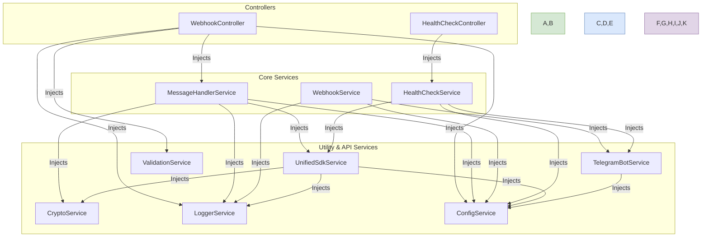

# Component Interaction: Service Dependencies

This document provides a diagram that illustrates the dependency injection graph for the application's services. It shows how services are interconnected and which modules provide specific functionalities.

## Service Dependency Diagram

## Explanation of Dependencies

This diagram shows how the NestJS dependency injection framework wires the application together.

-   **Controllers (`WebhookController`, `HealthCheckController`)** are the entry points and depend on services to perform their tasks. They are the primary consumers of the business logic.

-   **Core Services (`MessageHandlerService`, `WebhookService`, `HealthCheckService`)** represent the main business logic of the application. They orchestrate the utility and API services to achieve their goals.
    *   `MessageHandlerService` is the most central component, depending on the `UnifiedSdkService` to send data and the `CryptoService` to transform it.
    *   `WebhookService` and `HealthCheckService` depend on the `TelegramBotService` to communicate with the Telegram API.

-   **Utility & API Services** are the lowest-level components, providing specific, reusable functionalities.
    *   **`ConfigService`** is a foundational service injected into almost every other service that needs access to environment variables.
    *   **`LoggerService`** is also widely used for consistent logging.
    *   **`UnifiedSdkService`** and **`TelegramBotService`** are abstractions over external APIs.
    *   **`CryptoService`** and **`ValidationService`** are pure utility services with no external dependencies.

This decoupled architecture makes the system easy to test and maintain. For example, when testing `MessageHandlerService`, the `UnifiedSdkService` can be easily mocked to simulate different network conditions without making actual API calls.
