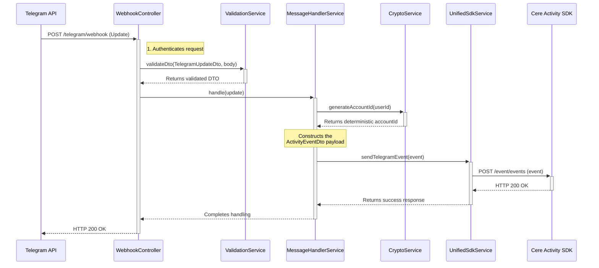

# Data Flow: From Webhook to Event

This document provides a detailed sequence diagram illustrating the primary data flow for the bot: processing an incoming Telegram message and converting it into a structured Cere event.

## Sequence Diagram

## Explanation of the Flow

1.  **Webhook Received**: The process begins when the Telegram API sends a `POST` request containing an `Update` payload to the bot's `/telegram/webhook` endpoint.

2.  **Authentication & Validation**:
    *   The `WebhookController` first authenticates the request by checking the `X-Telegram-Bot-Api-Secret-Token` header.
    *   It then passes the request body to the `ValidationService`, which uses the `TelegramUpdateDto` to validate the structure of the incoming data. If validation fails, an exception is thrown and a `4xx` error is returned.

3.  **Core Logic Handling**:
    *   The validated `update` object is passed to the `MessageHandlerService`.
    *   The `MessageHandlerService` extracts the Telegram `userId`.

4.  **Cryptographic Transformation**:
    *   The `MessageHandlerService` calls the `CryptoService` with the `userId`.
    *   The `CryptoService` uses a deterministic algorithm to generate a unique, privacy-preserving `accountId` and returns it.

5.  **Event Creation**:
    *   The `MessageHandlerService` assembles the final `ActivityEventDto` payload, combining data from the original message (group name, message content) with the newly generated `accountId`.

6.  **Event Dispatch**:
    *   The complete event object is passed to the `UnifiedSdkService`.
    *   The `UnifiedSdkService` handles the actual HTTP request to the Cere Activity SDK, including logic for retries in case of transient network failures.

7.  **Final Response**:
    *   Once the `UnifiedSdkService` confirms the event has been sent, the `MessageHandlerService` completes its work.
    *   The `WebhookController` returns a `HTTP 200 OK` response to the Telegram API to acknowledge successful receipt of the webhook. This must be done promptly to prevent Telegram from resending the update.
