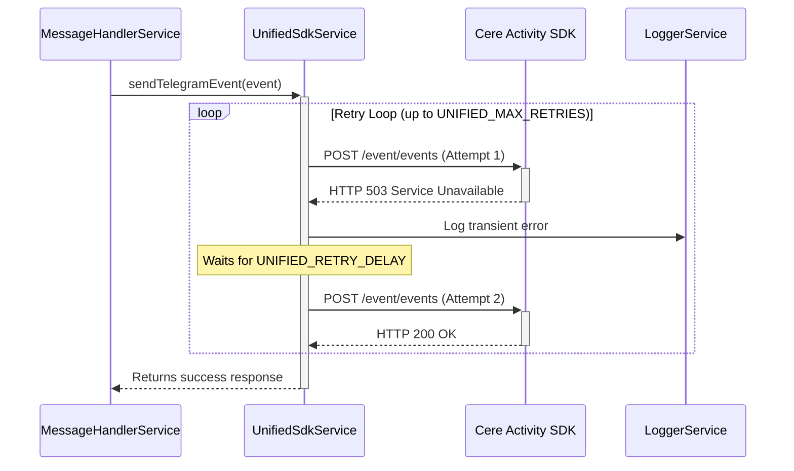

# Data Flow: Error Handling

This document illustrates how errors are handled within the application, with a focus on the retry mechanism provided by the `UnifiedSdkService`.

## Error Handling Sequence Diagram

## Explanation of Error Handling

The bot's error handling is designed to be resilient, especially concerning the critical step of forwarding events to the Cere network.

1.  **Validation Errors**: If an incoming webhook request fails authentication or DTO validation in the `WebhookController`, the process is halted immediately, and a `4xx` HTTP error (e.g., 401 Unauthorized, 400 Bad Request) is returned to Telegram. This prevents invalid data from entering the system.

2.  **Service-Level Errors**: If a service like the `CryptoService` fails, it will throw an exception. This exception propagates up and is caught by NestJS's global exception filter, which results in a `5xx` HTTP error response to Telegram. Telegram will then typically retry sending the webhook after a backoff period.

3.  **Event Dispatch Failures (Transient)**: This is the most critical error scenario, handled by the `UnifiedSdkService`.
    *   When the service attempts to send an event to the Cere Activity SDK, the downstream service may be temporarily unavailable (e.g., returning a `503` error).
    *   The `UnifiedSdkService` is configured to automatically **retry** the request.
    *   The number of retries and the delay between them are configurable via environment variables (`UNIFIED_MAX_RETRIES` and `UNIFIED_RETRY_DELAY`).
    *   This ensures that temporary network issues or brief service outages do not result in data loss.

4.  **Event Dispatch Failures (Permanent)**: If the `UnifiedSdkService` exhausts all its retry attempts, it will throw a final exception. This is treated as a service-level error, resulting in a `5xx` response to Telegram, which may trigger alerts in the monitoring system.
