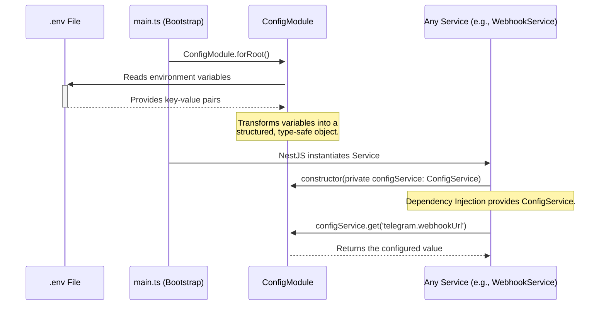

# Data Flow: Configuration

This document explains how configuration is loaded and utilized within the bot at startup, ensuring that all services have secure access to necessary parameters and secrets.

## Configuration Loading Sequence Diagram

## Explanation of Configuration Flow

1.  **Loading from `.env`**: When the application starts (`main.ts`), the NestJS `ConfigModule` is one of the first modules to be initialized. It automatically searches for a `.env` file in the root of the project.

2.  **Parsing and Structuring**: The `ConfigModule` reads the key-value pairs from the `.env` file and uses the `config/configuration.ts` factory function to transform them into a structured, nested JavaScript object. This makes access more intuitive (e.g., `telegram.botToken` instead of `TELEGRAM_BOT_TOKEN`).

3.  **Global Availability**: The `ConfigModule` is registered as a global module (`isGlobal: true`), meaning that any other module in the application can access the configuration without needing to import `ConfigModule` explicitly.

4.  **Dependency Injection**:
    *   When a service (e.g., `WebhookService`, `MessageHandlerService`) is instantiated by the NestJS dependency injection container, it requests the `ConfigService` in its constructor.
    *   NestJS automatically provides the singleton instance of the `ConfigService`.

5.  **Accessing Values**: The service can then use the `configService.get()` method to retrieve configuration values in a type-safe manner. For example, `configService.get<string>('telegram.webhookUrl')` retrieves the webhook URL and ensures it's treated as a string.

This flow ensures that configuration is loaded once at startup and is securely and efficiently provided to all parts of the application that need it, without scattering `process.env` calls throughout the codebase.
